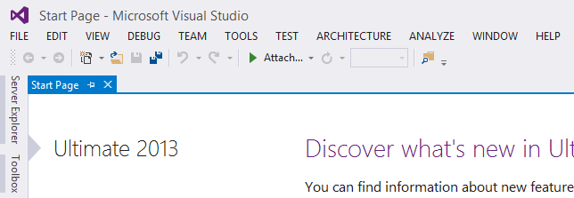
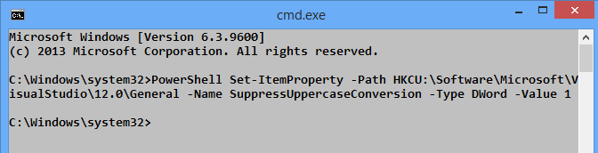
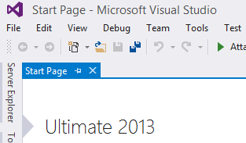

<!-- {PublishedOn:"Oct 17 2013 20:45", Title:"Changing ALL CAPS Visual Studio 2013 Menu With A One Line Command", Intro:"Change the Visual Studio 2013 menu from ALL CAPS to Title Case with ONE command."}-->

Visual Studio 2013 launched this week, and like its Release Candidate and VS 2012 predecessors, its menu bar is presented in ALL CAPS.

The [new revamped Options dialog](http://blogs.msdn.com/b/zainnab/archive/2013/07/03/visual-studio-2013-preview-options-dialog-changes.aspx) is nice, but it does not contain an option for users to revert the menu to Title Case.

###Back To Title Case###

Don't waste time on a VS extension to fix. Just use this **one-line** command on the command line (`cmd.exe`). It launches PowerShell, and PS will create the appropriate registry key to set that VS 2013 menu to be presented Title Case.

**Copy and paste this into a Command Prompt**:

    PowerShell Set-ItemProperty -Path HKCU:\Software\Microsoft\VisualStudio\12.0\General -Name SuppressUppercaseConversion -Type DWord -Value 1

You can't Ctrl-V unfortunately, you must right-click and select Paste.

Relaunch VS. Boom. Done.

