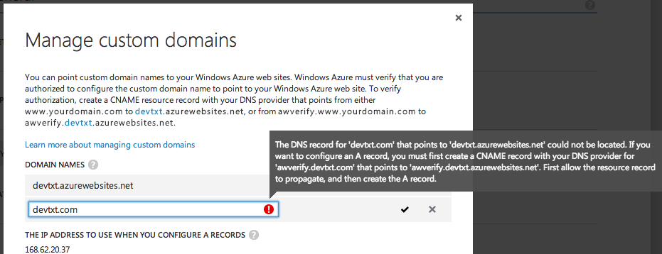
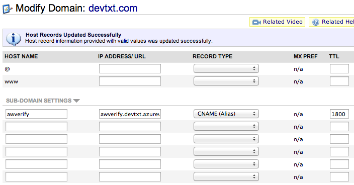
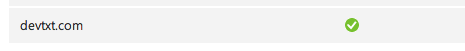

<!-- Title:"Configuring DNS at NameCheap For Windows Azure ",PublishedOn:"", Intro:"Having trouble configuring your DNS settings at NameCheap for Windows Azure?"-->

##NameCheap DNS Configuration for Windows Azure##

Super frustrating bit of configuration here for a few days.

Azure has a bit of inconsistency in what they require you to do at your name registrar.

>The DNS record for 'devtxt.com' that points to 'devtxt.azurewebsites.net' could not be located. If you want to configure an A record, you must first create a CNAME record with your DNS provider for 'awverify.devtxt.com' that points to 'awverify.devtxt.azurewebsites.net'. First allow the resource record to propagate, and then create the A record.

##What Worked For Me##

First, configure to have the `awverify` subdomain only.

Then, after some time to propogate, Azure will recognize this as valid, but actually *failed to save* for me.

Finally I went and created the domain CNAMEs:

That finally solved all the issues. 