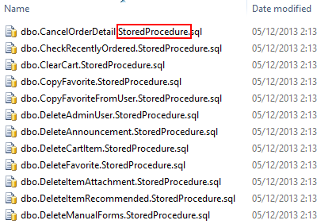
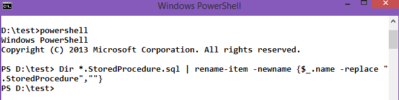

<!--{Title:"Batch Rename Files to Remove a String From The File Name", PublishedOn:"Dec 6 2013", Intro:"I recently scripted out stored procs to a file. SSMS included "StoredProcedure" in the file name, which I wanted to remove. Here's how to remove a substring in many files in a directory with one line of PowerShell."} -->

Use this PowerShell command to rename all the files in the directory to remove the "StoredProcedure" substring. This substring showed up for me when SQL Server Management Studio's Generate Scripts utility wrote the files out to disk. The same suffix is present when scripting out other objects - `View`, `Table`, etc.
 


###Remove Filename Substrings With PowerShell###
Open a command prompt, navigate to the directory your files are in, and run this one-liner to remove those substrings.
```
PowerShell
Dir *.StoredProcedure.sql | rename-item -newname { $_.name  -replace ".StoredProcedure","" }
```



Hat tip to [Steve's article on Tweaks.com](http://tweaks.com/windows/49459/batch-file-rename-with-windows-powershell/)