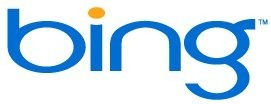

<!--{Title:"Bing: One Month of Success", PublishedOn:"2009-07-10T07:42:22", Intro:"Bing, You've Done Well.   I don't have any problems with Bing. That sounds like a backhanded complim"} -->

###Cool With Bing.###
 I don't have any problems with Bing. That sounds like a backhanded compliment, but it's definitely meant as a kudo. [For Bing, Dethroning the Big G is a Gargantuan task](http://blog.searchenginewatch.com/090709-160556). 

[David Pogue at the New York Times has a great video review of Bing](http://bit.ly/7Ypbk). He talks a lot about the consumer-ish features, which I didn't really pay attention to. Yes, the Ajaxy previews are a great feature. The image searches feel a lot cleaner to me as well. I don't really care for all the text cruft when looking for an image. If I want a 'big'-ish image, I'll choose the size option from the left menu. Still, it's in Bing's interest to give value to the searches that most humans are doing: travel, local and consumery type things.

###As a Developer...###
...all I really needed to know is why I was getting ['Cannot implicitly convert type 'System.Xml.XmlDocument' to 'System.Xml.XmlNode''](http://www.bing.com/search?q=Cannot+implicitly+convert+type+%27System.Xml.XmlDocument%27+to+%27System.Xml.XmlNode) when trying to pass `XmlDocument` back and forth between web services. (hey, I didn't specify XmlNode, but that's what gets auto-generated in your web service's  Reference.cs!) Oh look, first result!

A month ago, I took the [Bing 1 Month Challenge](http://devtxt.com/blog/post/Bing-Switchover-One-Month-or-More.aspx). There were a handful of times that I felt I might be able to do better in Google, and about half those times, I found what I was looking for in Google. The majority of searches though, Bing provided me with the results that I need. Basically it never left me hangin'. Who would have thought that a rebranded, remixed and Ajax'd MSN Search would have turned out so well?
The guys on the [Herding Code Podcast](herdingcode.com) pretty much panned it a month ago on [Herding Code Episode 49](herdingcode.com/?p=186) . I am much more optimistic for Bing's future. I'll be keeping it as my default search engine.

###Celebrate Good Times###
Great job,  Bing Team! Kudos!

