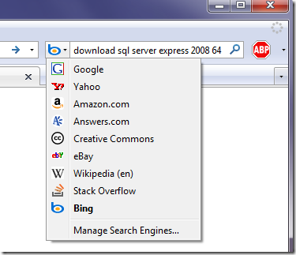

<!--{Title:"Bing Switchover: One Month or More", PublishedOn:"2009-06-09T23:40:09", Intro:"Like 95% of the searching masses, I use Google as the primary engine in my browser search fields. Su"} -->

Like 95% of the searching masses, I use Google as the primary engine in my browser search fields. Sure, I have installed the usual suspects of other sites that I like to search by. OK, I only ever used Wikipedia once or twice, and Stack Overflow is nice to have. I find it difficult, to switch search engines WITHOUT using the mouse. Maybe it's just me, and there's a magical keyboard shortcut to switch to Next Engine, or something.

###Bing?!###
After hearing the big news about <strike>MSN's rebrand</strike>, the launch of [Microsoft's new search engine Bing](www.bing.com) on the usual podcasts, AND having Scott Hanselman challenge his readers to judge Bing after using for a month. I thought it would be a flash in the pan. 

###Loyalty and Affinity###
Some people feel loyalty to brands, and some to search engines. Me, I just stick with Google because it works, and it looks clean. That's about it. I don't have any natural affinity to my search provider, so I am going to take the Bing Challenge. So at home, work and the laptop, I have changed my primary search providers to the 'blue b'.

You can see in the screenshot above that I really threw it a softball. Get ready Bing, people are paying attention!
