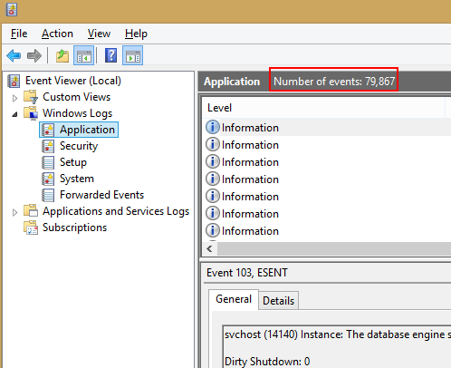

<!--{Title:"Create A New Windows Application Event Log With PowerShell",Intro:"Stop writing to the Windows legacy Application event log. It's a nasty dumping ground.",PublishedOn:"15-Jul-2014"}-->

### Old Style Application Event Log

In the foggy dawn of time pre-Windows Server 2008 (OK fine, Vista), the Event Log was simpler. There were 4 logs, and it was a large scrolling list. You could filter for your source(i.e. your app), but you couldn't save that view. Your app dumped every message into the Application log along with everyone else.

### Modern Windows Event Logs

You *can* continue to have your application write to the Application log. When you do, though, you are in the same situation as before: a ridiculously large log that you need to hunt through. 

### Create Your Own Application Log

Keep your logs organized, keep them separate from everything else running on the box. Create your own event log for your application. 

You cannot create an event log in the Event Viewer GUI. You can most easily create one via PowerShell.

The only tweak you need to make is **Line 10** - the name you want for your Event Log.

This script will:

- give you appropriate permissions in the registry to create event logs
- create the event log
- write an initial entry to allow you to see it in Event Viewer

For this script, you must **Run As Administrator**.

Refresh Event Viewer. If your new log doesn't show up, then you should exit and re-open Event Viewer. 

Then log away from your .NET client:

    if (!EventLog.SourceExists("MyApp"))
    {
        EventLog.CreateEventSource("MyApp", "MyEventLog");
    }    
    EventLog.WriteEntry("MyApp" "some log msg", EventLogEntryType.Information);