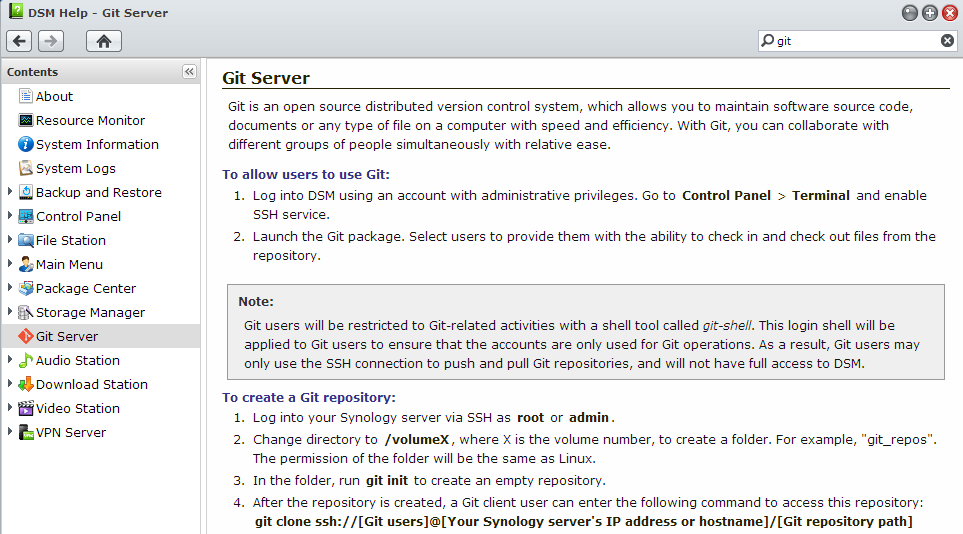

<!--{Title:"Installing Git On Synology NAS DSM 4.3+", PublishedOn:"", Intro:"Running Git on the Synology NAS was an appealing feature of the 4.3 release in summer 2013. For me, I want Visual Studio integration to work as well with the Microsoft Git Pr"} -->

Sources:
* [Synology Forum thread "Git Server"](http://forum.synology.com/enu/viewtopic.php?f=190&t=73064&p=281637)