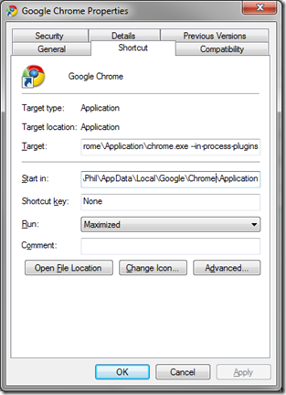

<!--{Title:"Google Chrome and Windows 7 64 bit", PublishedOn:"2009-04-26T06:33:05", Intro:"As of this post, Google Chrome doesn't work out of the box with Windows 7 64 bit. Funny, because tha"} -->

As of this post, Google Chrome doesn't work out of the box with Windows 7 64 bit. Funny, because that didn't happen with Vista 64. Oh well!
The funny part is Chrome's version of the <a href="http://catesmusings.files.wordpress.com/2008/03/sadmac.gif">sad Mac</a>. Well done, team!
The kicker here is that it DOES work, just that you have to set some command line options on the shortcut.
  <table border="0" cellspacing="0" cellpadding="2">
    <tbody>
      <tr>
        <td valign="top">
          

          <ol>
    * Find the shortcut properties. 
    * Modify the target: **chrome.exe --in-process-plugins**
    * No quotes are needed here. 
    * Save and relaunch. Voila!
          </ol>
        </td>
      </tr>
    </tbody>
  </table>