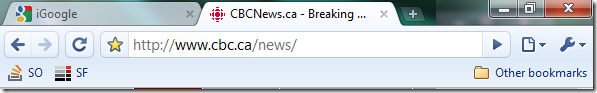

<!--{Title:"Google Chrome's Early Days - Needs Just A Touch More Work", PublishedOn:"2009-07-25T08:44:04", Intro:"Being a duty-bound software/web developer, you have to keep a working knowledge of the latest browse"} -->

Being a duty-bound software/web developer, you have to keep a working knowledge of the latest browsers. Surf the web too, right?! I've used Firefox exclusively since maybe 2004. I was happy to jump from IE at the time, and I lament having to use it in the corporate environment. It's <strike>astonishing</strike> disheartening to walk to a poor downtrodden co-worker's PC (which is locked-down and managed centrally by the IT dept.), and see [IE6 in all its outdated non-tabbiness](http://www.stoplivinginthepast.com/). I appreciate though, the ability to depend on ONE browser being used in that scenario, and so it makes life a lot easier. 

[Chrome has been out for almost a year](http://en.wikipedia.org/wiki/Google_chrome) now, and I have had it installed and upgraded since its beta. I've used it off and on, but never gave it my SERIOUS attention. I've had the urge to give it some due attention. I've used it for 2 weeks straight now on 2 machines everyday. The conclusion is: switching back to Firefox.
###What Chrome Does Well ###

**Speed Perception** - As a user I perceive Chrome to be a fast renderer. I feels slicker and cleaner. While visiting sites like StackOverflow, the HTML elements appeared to show all at once.

**Little User Interface Niceties**

<table border="0" cellspacing="0" cellpadding="2" width="722">
 <tr> <td valign="top" width="473">input fields glow a nice orange when they've got focus.</td>
<td valign="top" width="247">
 
 </td>
</tr>
<tr>
<td valign="top" width="473">Hovering over a link will cause its URL to show in a smaller status bar below (saving screen real estate). </td>
<td valign="top" width="247">

</td>
</tr>    
</table>

**Recently Visited Sites Thumbnails** - upon startup, or in a new tab, you'll be shown a panel of your most visited sites. This saves time, and thank you Google. Great little innovation, and I hope the competition picks this up. Oh, [Apple Safari already has thumbnail previews](http://images.macnn.com/esta/content/0902/safari4-topsites.jpg)? Excellent news.

**Smaller screen footprint** - this was great on the netbook. With a 600ish vertical pixel limitation, you need every half inch you can get. Chrome is very minimal with its menu, address/search bar and favorites bar. Very impressed with this design.

**Search/Address Bar** - this is no real revelation, but the address bar is also the search box. Just type in your query/keywords and be done with it. Yes, the search engine is customizable to your favorite search engine. No, it's not [hardcoded to Google for evil reasons](http://www.wired.com/wired/archive/11.01/google_pr.html). No need for the extra search box. Yes, the same functionality is in Firefox and IE7/8.

**As a developer** - there's the same Firebug-ish functionality to Inspect an Element on a page. It opens the View Source page, and navigates to the element that you've right clicked on. It's presented in a full-screen window, and it takes some wrangling to get the window off to one side. Sure, move it to another monitor, that'll work OK as well. Flip to the Resources view, and you can view Graphs by Time and Size. It looks promising!

**Auto-Updating** - As with Firefox, the user doesn't have to do anything. Sure, you have to visit the About dialog box.

###Why I Cannot Permanently Switch to Use Google Chrome###

* [Ads and More Ads](https://addons.mozilla.org/en-US/firefox/addon/1865) - it's astonishing to see how littered the web is when you use a browser without ad blocking software. There are flashing ads like crazy. I hadn't heard of the [recent ridiculous ads that online game developers and advertisers](http://www.codinghorror.com/blog/archives/001286.html) have put out recently. Then using Chrome, I ended up seeing them, along with all the usual monkey-punching suspects. The web is laden with ugly ads on all manner of sites. Regarding Flash ads: [more sites should have this ad philosophy](http://blog.stackoverflow.com/2009/03/responsible-advertising-feed-a-programmer/) and stick to it. Yes, there are ways around it, but this functionality doesn't need to be that complicated. [Adblock Plus on Firefox has you covered](http://adblockplus.org/en/).

* [Firebug on Firefox](http://getfirebug.com/) - this plugin REALLY helps when you're trying to determine why a bold isn't working, or why the spacing is working well. It opens in a smaller docked window, and **feels** easier to manipulate the HTML that's being shown.

* [Pass-through Windows Authentication](http://serverfault.com/questions/19914/) - when you visit a site on your intranet which is secured via Windows Authentication, Chrome will present a login dialog. That's fine and forgivable... once. The browser is not baked into the OS. However, you've got to remember my credentials for next time! Major frustration here. 

* **Firefox's Addons** - there are a huge number of Firefox addons. Sure, you aren't going to install them all, but there are a few that I really like - [Xmarks](https://addons.mozilla.org/en-US/firefox/addon/2410), [WebMail Notifier](https://addons.mozilla.org/en-US/firefox/addon/4490), password management, download managers, plugins for Twitter, Facebook, etc. 

* **My Usage Patterns** - clicking with the mouse wheel on a Favorites directory. I am used to having all links within that folder open in new tabs (Firefox and IE8 do this!) Sadly, Chrome does not!

**Summary**

The features I am looking for as a user and a web developer aren't comparable to the features of Firefox. It's early days for Google Chrome, and I have no doubt that Google will be adding valuable features to this browser as time goes on.

Google Chrome - it's fast, but the ad-blocking is a must-have for sanity's sake. I'd love to re-evaluate in the near future! 
