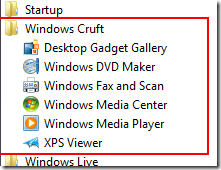
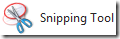
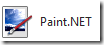
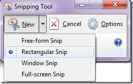
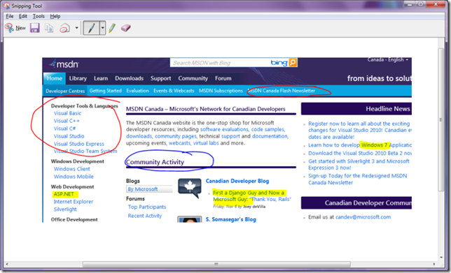

<!--{Title:"Neat Windows 7 Productivity Enhancer - Snipping Tool", PublishedOn:"2009-11-10T04:34:22", Intro:"Usually when jumping into a new OS, I largely disregard the built in programs. My typical thought is"} -->

Usually when jumping into a new OS, I largely disregard the built in programs. My typical thought is that they're for newbies, grandmas, and otherwise lack the features that other 3rd party programs offer. (think MSPaint, Getting Started, Fax/Scanner Wizard, Welcome to XP videos, etc). It got so annoying that I actually go out of my way on new installs to make a new folder on the Start Menu to bury those shortcuts.

Special-K  brought the new Windows 7 Snipping Tool to my attention, and it's most definitely a productivity enhancer. My snap judgment was "really, a built-in Windows tool?", but after 10 seconds of using this tool, I knew I'd be using it immediately in place of my current screenshotting process.

###Screenshotting###
Here's my typical old style of creating a screenshot. Typical use case here is to send a cropped &amp; marked-up screenshot by email, or perhaps for insert into Windows Live Writer.
<table border="0" cellspacing="0" cellpadding="2" width="400">
<tbody>
<tr>
<td valign="top" width="105">

     
</td>
<td valign="top" width="295">
<b>Total Clicks/Buttons = up to 15</b>
</td>
</tr>
</tbody>
</table>

* Alt-PrtScn 
* Open [Paint.NET](http://www.getpaint.net/features.html)
* Ctrl-V 
* Start cropping 
* Change the color selector to red or yellow or something to make your selection stand out 
* Select the Oval or Rectangle tool to highlight what you need. When Oval doesn't line up the way you want, Ctrl-Z, and try again x3. 
* Either: *a)*`Select All - Ctrl V` into a new email or *b)* Save As -> enter a filename, save to desktop. Open email client (Gmail or Outlook), and attach to email as attachment. 

###Stop the Insanity with Win7's Snipping Tool###

<table border="0" cellspacing="0" cellpadding="2" width="400">
      <tr>
        <td valign="top" width="110">    

        </td>
        <td valign="top" width="290">
  **Total Clicks = max 5**
        </td>
      </tr>
</table>

* Keyboard Start key 
* Type sn as if you were typing snipping tool. Hit Enter. 
* Start cropping 
* Highlight, markup, erase, recrop to your heart's content. 
* Click the Email button to generate a new email message with the image embedded. Launches the default mail client. Works well with Outlook and Gmail. 

<table border="0" cellspacing="0" cellpadding="2" width="100%">
 <tbody>
 <tr>
<td valign="top" width="255">

</td>
<td valign="top" width="391"> Being the artsy type, you'll probably want to screenshot in different ways. I think the typical use-case would be the rectangle, whereby you click-drag a rectangle to highlight the parts of your screen that you want. Otherwise, you have the ability to screenshot:        
 * a window you choose (it outlines the window when you hover over it, Win7 style) 
 * free-form, lasso-style! 
 * the entire screen         
 </td>
 </tr>
 </tbody>
 </table>

### Notes ###

* doesn't work <strike>well</strike> when you're trying to capture something from your Start menu! 
* it's super easy to snip/screenshot your entire toolbar. Select Window Snip, and click your toolbar. The tool captures just your toolbar, from Start button to minimize button. Awesome! 
* saves as .png by default. Yes, Paint.NET does this as well.
* turns out the .exe isn't named `winsnip.exe` (which I would have loved), but rather `C:\Windows\System32\SnippingTool.exe`

