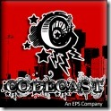
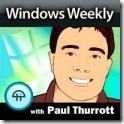
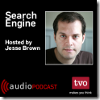

<!--{Title:"Podcast Favorites", PublishedOn:"2009-06-14T18:34:00", Intro:"I'd like to share my favorite tech podcasts. These are in no particular order! You probably won't be"} -->

I'd like to share my favorite tech podcasts. These are in no particular order! You probably won't be surprised, it's the list of usual suspects circa 2008/2009. Click on each to go directly to the podcast's main page. You can find the RSS feed there!
###Developer Centric Podcasts###
  <table border="0" cellspacing="3" cellpadding="3" width="100%">
    <tbody>
      <tr>
        <td valign="top">
  
<a href="http://www.dotnetrocks.com/">.NET Rocks  </a>
      
</td><td valign="top">
  
<a href="http://hanselminutes.com/">Hanselminutes               </a>
      
</td><td valign="top">
 
<a href="http://www.thirstydeveloper.com/">Thirsty Developer               </a>
      
</td>
<td valign="top">
  
<a href="http://blog.stackoverflow.com/">StackOverflow               </a>
      
</td>
</tr>
<tr>
<td valign="top">
</td>
 <td valign="top">
  
<a href="http://herdingcode.com/">Herding Code               </a>
 </td>
<td valign="top">
  
<a href="http://www.code-magazine.com/codecast/">CodeCast               </a>

</td>
<td valign="top"></td>
</tr>
    </tbody>
  </table>

###I.T. Industry or General Tech###
  <table border="0" cellspacing="3" cellpadding="3" width="100%">
    <tbody>
  <tr>
  <td valign="top">
  
<a href="http://www.runasradio.com/">RunAs Radio               </a>
      
</td>
<td valign="top">
  
<a href="http://twit.tv/ww">Windows Weekly               </a>
      
</td>
<td valign="top">
  
<a href="http://thisweekinstartups.com/">This Week in Startups               </a>
      
 </td>
<td valign="top">
          
</td>
</tr>
<tr><td valign="top">
<a href="http://feeds.tvo.org/tvo/searchengine">Search Engine               </a>
      
</td>
<td valign="top">
  
<a href="http://twit.tv/twit">This Week in Tech               </a>
      
</td><td valign="top">
  
<a href="http://twit.tv/sn">Security Now               </a>
      
</td>
<td valign="top"></td>
</tr>
</tbody>
  </table>

###Scratched!###

* Alt.Net podcast - sorry guys, it was getting to sound a little too negative. I enjoyed the [Domain Driven Design](www.altnetpodcast.com/episodes/15-domain-driven-design)</a> episode! 
* [Polymorphic podcast](polymorphicpodcast.com) - Craig sounds like a really nice guy, but there was a lull in the regularity of the podcasts, so I abandoned it. 
* [ASP.NET podcast](aspnetpodcast.com) - didn't tickle my fancy. It's not you, it's me. Serious! 

###Wish List###

* <a href="http://weblogs.asp.net/scottgu">Scott Gu</a> -  Microsofties are blogging like crazy, I wonder if Scott has any time on his hands to do his own podcast. Ya right. He can be found as a guest here and there. 

What great developer podcasts or I.T. podcasts are out there that are missing from this list?!? Are YOU starting a podcast and wanting some listeners?  
