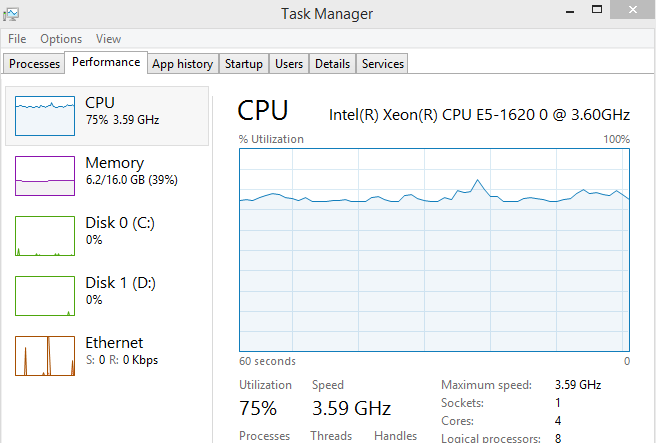
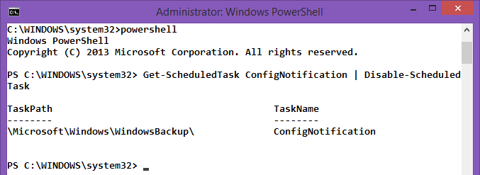
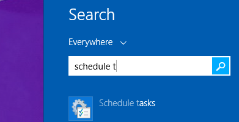
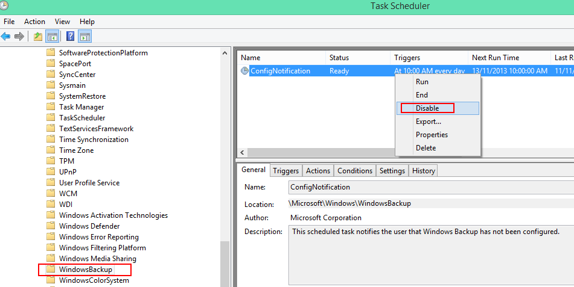

<!--{PublishedOn:"Nov 13 2013",Title:"Upgrading To Windows 8.1 Causes Gradually Increasing CPU Usage",Intro:"High CPU usage in Windows 8.1 "}-->
I upgraded an installation of Windows 8 to Windows 8.1 as soon as 8.1 was released on MSDN (~Sep 2013). I noticed a few days afterward that Task Manager was reporting very high CPU usage, and I knew that it wasn't a result of any operations I was running. The CPU usage increase wasn't spikey, or happen immediately, but rather it would increase gradually and slowly over time. It would hit 90% and leave little resources left for me.

This resulted in the machine needing to be restarted every few days or so. After a weekend, Task Manager would show the CPU usage like this while the machine was **idle**:

##Solution: Turn Off Job ConfigNotification in Windows Task Scheduler##

I posed this as a [question on SuperUser](http://superuser.com/q/674999/1455) and the solution given worked. It turns out that there's a process in upgrade whereby if you're running the upgrade under a domain account, and not as Administrator, that something goes sideways, and results in this escalating CPU usage.

###Disable It Using PowerShell###

It's a one-liner. Run `cmd` as an Administrator (this is a must, even if UAC is disabled and you're in the Administrators group).

    Get-ScheduledJob ConfigNotification | Disable-ScheduledJob 

Then **restart Windows** to stop that crazy CPU usage.

####The Manual Way. Using A Mouse.####

Run the Windows Task Scheduler

Find the item in `Task Scheduler - Microsoft - Windows - WindowsBackup`. It's the only item in there: `ConfigNotification`.

Then **restart Windows** to stop that crazy CPU usage.