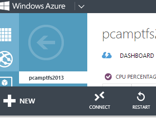
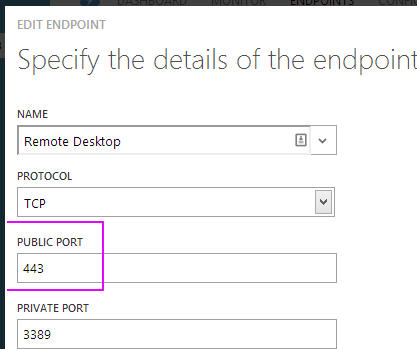

<!--{PublishedOn:"Jan 2 2014",Title:"Connecting To Windows Azure Virtual Machine From Your Corporate Workstation",Intro:"Here are some tips to get you started RDPing to your new Windows Azure virtual machine. I had a few tweaks to make because I was trying to connect from from my corporate workstation."}-->

When you create a Windows Server virtual machine in Windows Azure, the public RDP service endpoint will be chosen at random. This recent one here is `49390`, but the provisioning service will choose one at random. 

###Download the RDP File But Can't Connect From Workplace/Corporate Environment###

Click the Connect button. Your browser downloads the .rdp file.

When I used the given .rdp file from Azure, I get a connection error. 

It turns out that the corporate network I'm currently on is **whitelisting ports for outbound traffic** (the common ports a typical user would need: 80, 8080, 443, 21, etc.), and the one given by Azure, `49390`, isn't one of them. So the result is that your outbound request to the server is blocked at the firewall.

If you're working in a similar position where you can't RDP to your Azure virtual machine, you can change its port in the Endpoints section. Change the **public port**. I chose `443` as I won't be using SSL for this virtual machine.

Azure will take some time to reconfigure using your new settings; usually less than 1 minute.

###RDP'ing Into Your VM###

If you're connecting to a Windows virtual machine in Azure, the RDP will ask for your credential on the remote machine. The dialog box will default to your local credentials, including the domain. When you select "Other Account", it retains your Active Directory domain. 

To clear this out, use a single backslash `\` to clear out that domain. 
Enter your username as `\myusername`.

###Mistake Configuring RDP Endpoint###

 

If you manage to change the **private port** to one that the RDP service on the machine isn't configured with, you will end up with the Connect link on the Azure dashboard *disabled*. 
This is because your RDP request is being sent to that port on the machine where the RDP service isn't listening.

Fix it by changing it back to the port that the RDP service listens on: `3389`