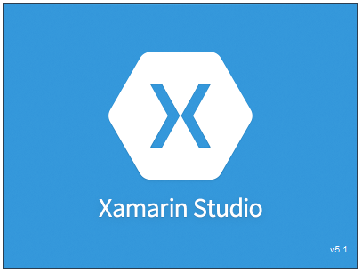
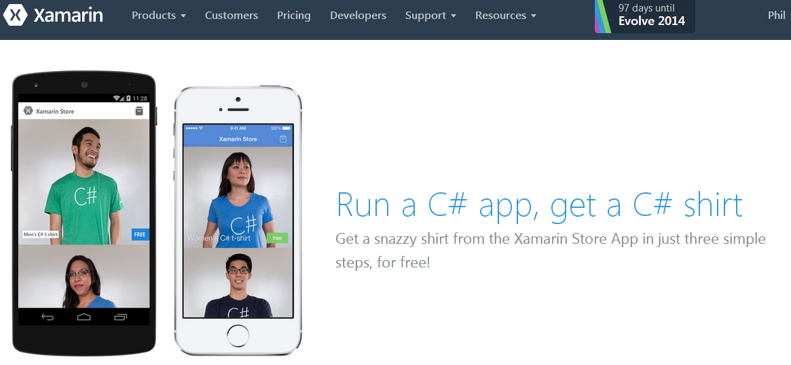
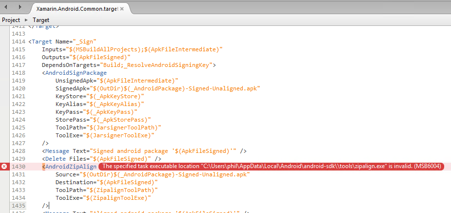
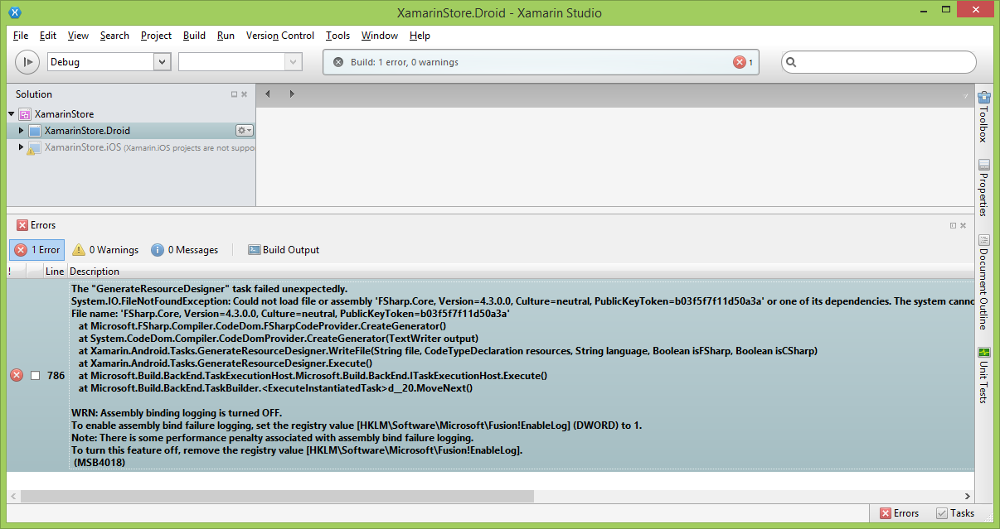

<!--{Title:"Xamarin Studio Sample Apps Have Some Problems",Intro:"I had some problems with the Xamarin sample apps in my first encounter with Xamarin Studio.",PublishedOn:"01-Jul-2014", Tags:["xamarin"]}-->

Recently I had the desire and chance to dig into Xamarin. They're high profile in my field of view these days after [their excellent showing at Build 2014](http://channel9.msdn.com/Events/Build/2014/3-653) (ack Xamarin guys, I know I'm late to the game), and with mobile development growing so quickly, I want to get in the game. No matter what my personal choice of mobile platform, Xamarin's promise is to help you write your app for Android, iOS, and Windows Phone without having to go learn Objective-C. Swift, or Java. Write for them ALL in C#. *swoon*. 

I installed Xamarin Studio on 2 machines - both Windows 8.1. One with Visual Studio, and another fresh VM without VS.

### Free T-Shirt Offer

What better way to start by giving out [free stuff](https://xamarin.com/c-sharp-shirt)!? Just install & run the sample store app. Cool! I like t-shirts, and I like C#! They were all over Build 2014. 

I was pumped! The sample apps demonstrate how to achieve all kinds of common mobile tasks: asyncronous operations, login/authentication, menus, and likely all kinds of challenges that I haven't ever encountered before with heavy ASP.NET experience.  

### Problems With Xamarin Sample Apps

My expectation was that it would be a click and run experience; dead simple without fuss. All the sample apps are available on GitHub and are even linked directly in [Xamarin Studio's start page](img/xamarin-studio-sample-apps.png). 

#### C Sharp

The C# sample app wouldn't run out of the box. The build failed with an error about zipalign.exe not being found. I hadn't heard about [zipalign](http://developer.android.com/tools/help/zipalign.html) before. eeek.

> The specified task executable location 'c:\users\me\appdata\local\android\android-sdk\\tools\zipalign.exe' is invalid. MSB6004

The error was correct: that file wasn't found. 

I created a [forum post](http://forums.xamarin.com/discussion/19331/specified-task-executable-location-zipalign-exe-is-invalid) about the issue, and found that others were experiencing the same issue.

It turns out you need to run the Android SDK manager, and [install newer Android SDK tools](img/xamarin-android-sdk-manager), and then copy the zipalign.exe into the directory that it expects.  

Here's an opportunity for improvement for the Xamarin install: try to have the installer install the newer SDK and all the various tools and build tools.

Once a modern emulator was set up, and the zipalign utility was in place, the app ran without problem. **Hooray!**

#### F Sharp

I loaded the [F# Store Sample App](http://xamarin.com/f-sharp-shirt) and hit Build. I was shown this error:

 

> C:\Program Files (x86)\MSBuild\Xamarin\Android\Xamarin.Android.Common.targets(2,2): Error MSB4018: The "GenerateResourceDesigner" task failed unexpectedly.
System.IO.FileNotFoundException: **Could not load file or assembly 'FSharp.Core, Version=4.3.0.0**, Culture=neutral, PublicKeyToken=b03f5f7f11d50a3a' or one of its dependencies. The system cannot find the file specified.
File name: 'FSharp.Core, Version=4.3.0.0, Culture=neutral, PublicKeyToken=b03f5f7f11d50a3a'
   
Indeed, the machine (Windows 8.1 with Visual Studio 2013 **doesn't** have FSharp.Core version 4.3.0.0. Visual Studio 2013 places a newer version: 4.3.1.0.
 
This basically means that my installation of F# is **too new**. The dev team building the Xamarin F# Store app built it against an older version of F# from Visual Studio, [probably from VS 2012](http://stackoverflow.com/a/20362049/23199).

I tried removing the F# reference in the project and referencing the one I actually have, but that didn't solve the problem.

My [Xamarin forum post](http://forums.xamarin.com/discussion/19550/building-fsharp-store-sample-project-filenotfoundexception-for-fsharp-core) shows that a bunch of other devs are in the same situation.

I tried loading this solution in Visual Studio, but ended up in a quicksand pit of other issues:

- had to remove the iOS project from the solution in Visual Studio.
- multiple occurrences of removing project type GUIDs from the .csproj: 

> There is a missing project subtype. Subtype: '{F278D4AB-4730-4720-B08E-FE5E31564D9E}' is unsupported by this installation.

#### Notes / Lessons Learned

- for Android development, these two utility/manager apps AVD Manager and SDK Manager are very important in helping with emulators. I'm an Android dev newbie, so I wasn't even aware.
-  the [default emulators that came installed were **terribly outdated**](img/xamarin-avg-defaults.png). They are awkwardly bad. You need to go add more modern emulators yourself (like Nexus 4 or 5). But hold up, you first need to get the CPU emulator images from a newer version of Android to get the Nexus emulator actually working.
-  iOS projects don't work out of the box; there's some extra fiddling that you need to do that I haven't even got to yet.
-  you'll need a Xamarin account and opt-in to a 30 day trial to unlock get Android development working. The clock is ticking until you'll start paying.
- the Xamarin support forums are active.
