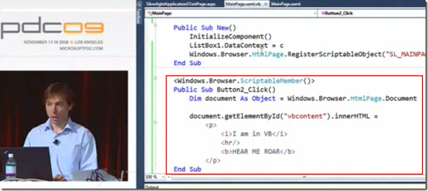

<!--{Title:"XML Literals in VB – Real World Usefulness?", PublishedOn:"2009-11-28T20:32:11", Intro:"Just a quick recent thought. As I am watching the PDC09 videos made available free online by Microso"} -->

Just a quick recent thought. As I am watching the <a href="http://microsoftpdc.com/Videos">PDC09 videos made available free online by Microsoft</a>, I got me thinking more about the recent changes/improvements in VB. A new feature for VB 9 in 2008 was <a href="http://msdn.microsoft.com/en-us/library/bb384629.aspx">XML Literals</a>. You know, writing/pasting plain old XML into your source code.  Like this simple example:

    dim myXML =  <custs>                
                      <cust ID="5" Name="Oscar" />
                      <cust ID="9" Name="Ernie" /> 
                 </custs>
    
My thoughts went like this:

* hey, cool! you don't have to wrap it in strings, thank goodness. 
* hmm, why would you be hardcoding XML anyway? 
* that belongs in a resource file somewhere, really. 

I basically have written off this feature as demoware, really, until I saw the video of <a href="http://blogs.msdn.com/lucian/">Lucian Wischik</a>'s session "<a href="http://microsoftpdc.com/Sessions/FT32">Code Like the Wind with Microsoft Visual Basic 2010</a>". There was one really intriguing feature in his demo of a VB Silverlight component. 
The key task that lured me in was a fairly simple demo dealing with HTML replacement. Great application of the technology! If you're being careful to write your HTML as XHTML, then this is a great way to use VB's XML Literals feature. Here's the simple use case from the demo:

* clicking an input button 
* replacing the innerHTML of a div 

The great thing I like about this that you don't necessarily have to mess around with `string.Format()` or `string.Concat()` and all those other small speedbumps. i.e.

    myDiv.innerHTML = string.Format("
<i>Hello {0}</i>
<b>Hello everyone, welcome to VB XML Literals</b>",customerName)

Perhaps take it a step further and externalize those snippets if you like. My first thought on that snippet was: "document.getElement? WHAT? Get some jQuery in there! Doh - it's code-behind!" Interesting how it's declared as an `Object` while being assigned `Browser.HtmlPage.Document`. Likely it's a quick/dirty demo artifact.

###Useful in the Real World?###

There's always the balance of demoware <em>vs.</em> actual best practices <em>vs.</em> your development standards. I am leery of hardcoding markup in your compiled app. It'll take an application <em>redeploy</em> to change that markup to something different. 
Of course, in the real world, you'd probably be loading something user-specific here, like a customer's name, shopping cart, etc. where you'd be wanting to `string.Format()` all those details anyway. Heck, you'd even want to iterate through your invoices, tweets, or whatever collection you'd want to start building a simple `<ul>` with your collection of business data in `<li>`. 
Even if it was a simple replacement of XML, with some business logic around which snippet to insert, consider if you'd had externalized those snippet into an XML resource file(s), you could refer to them easily, although not as simple as strongly typed XML literals **compiled** in a resource file. There's that balance again - ease of coding vs. maintainability in production.
 
I always like discovering new personalities at Microsoft. I'll be RSS'ing Lucian's blog, looking forward to seeing any great content he might share. 
###Real World Production Examples? ###
Do you know of any examples in the real world of VB and XML Literals in a production app? If/when I find some, I'll post a link here!
